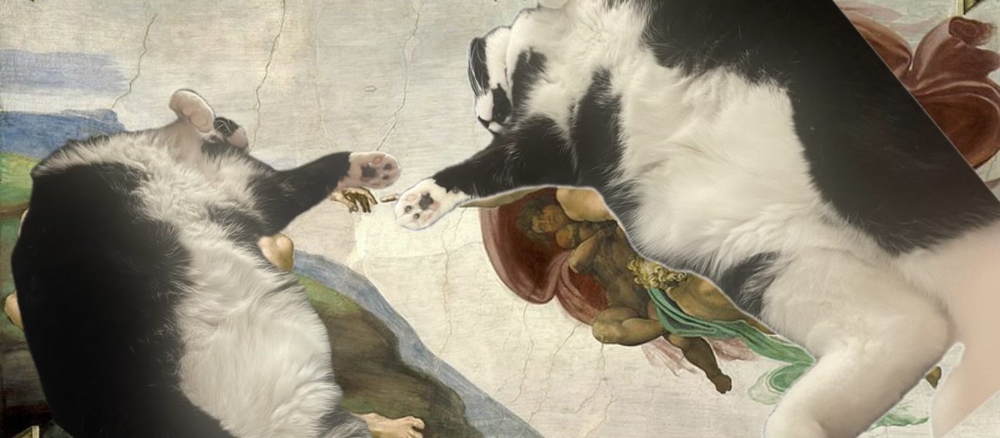
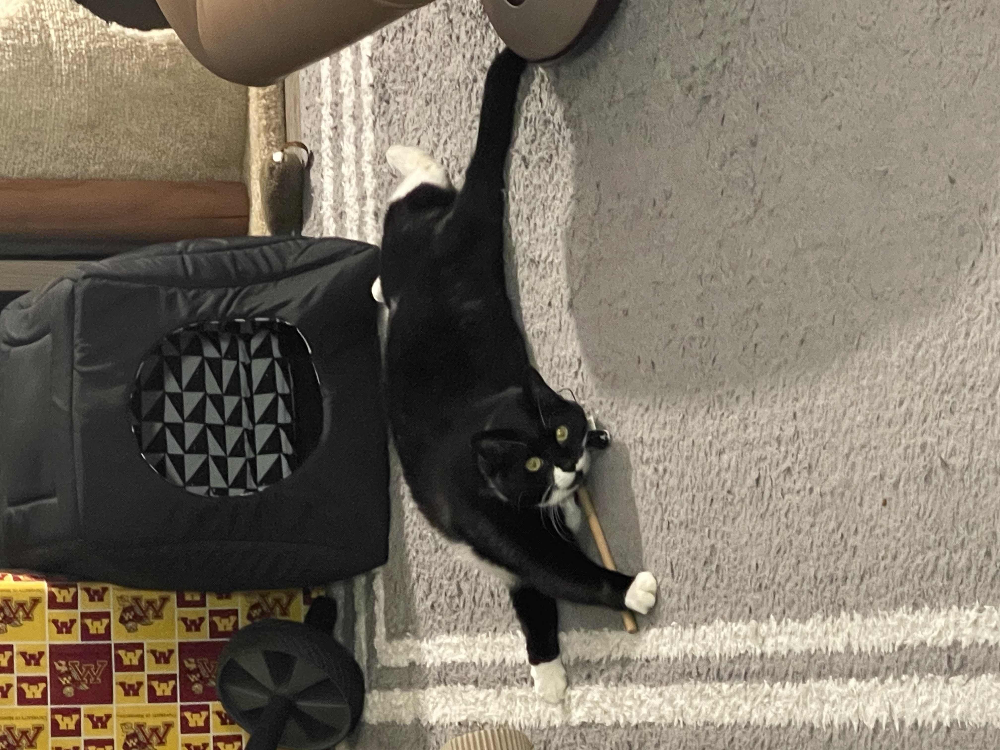
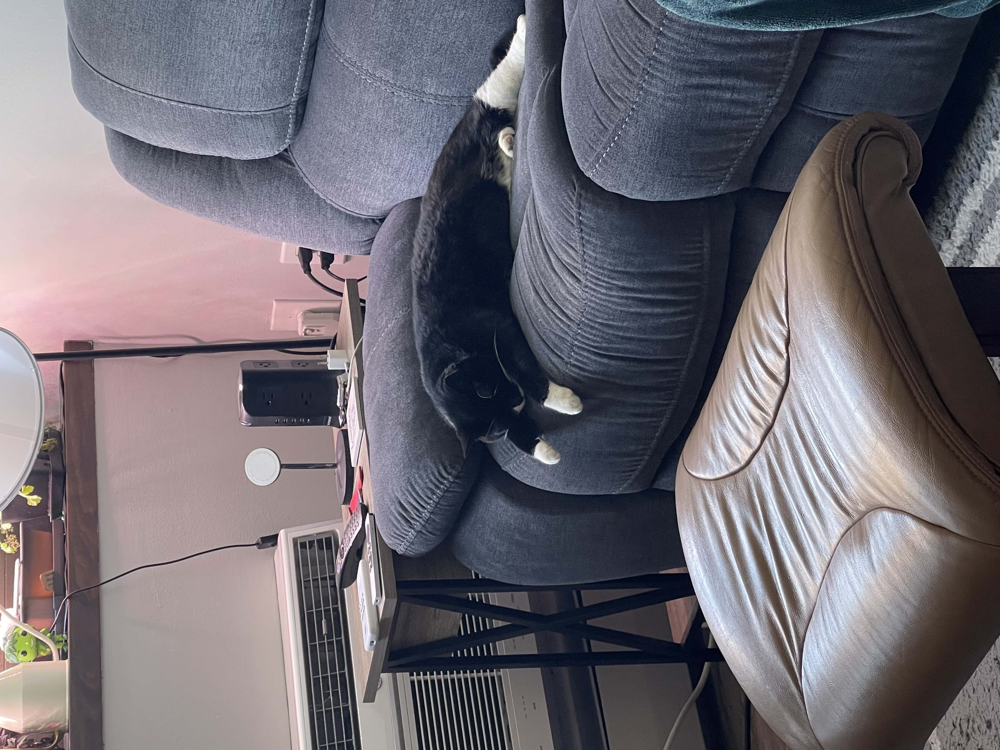
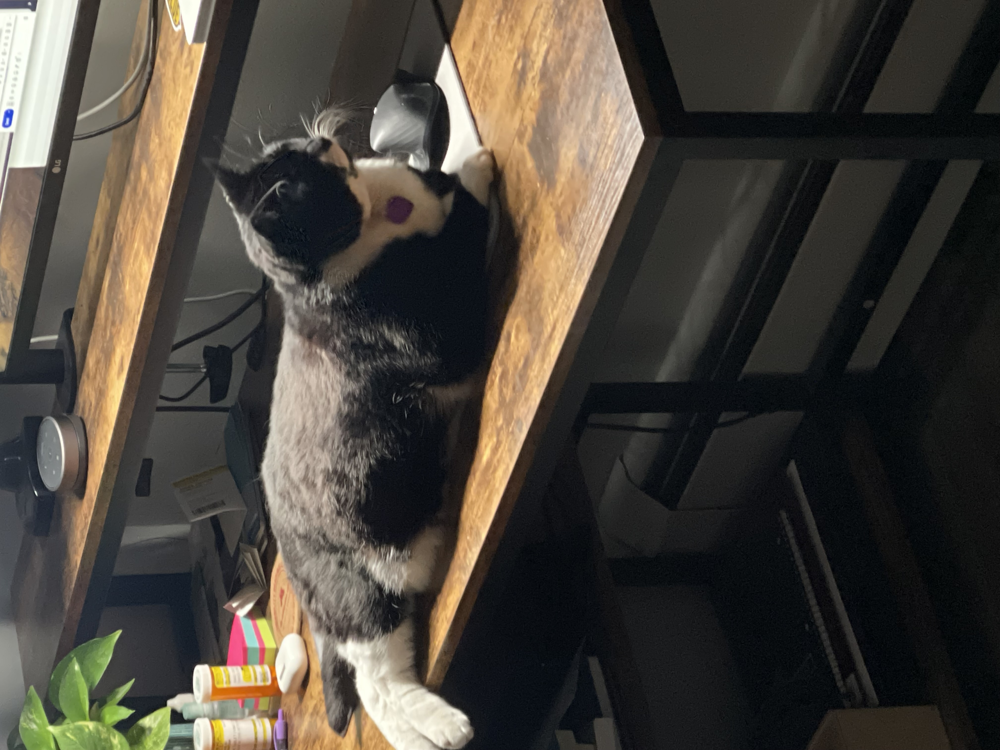
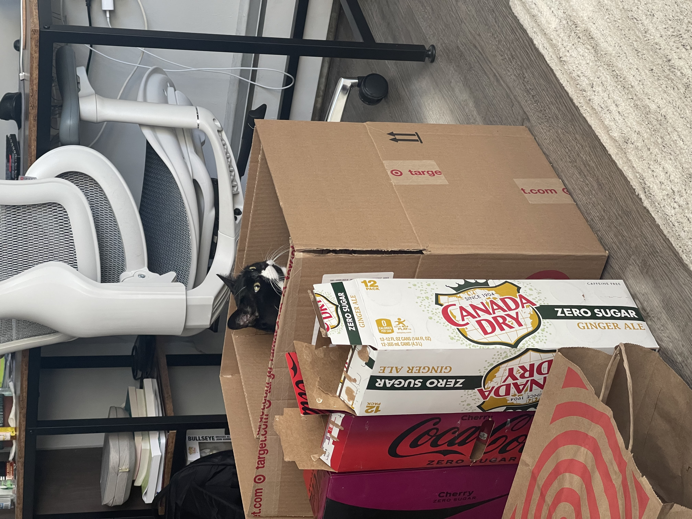
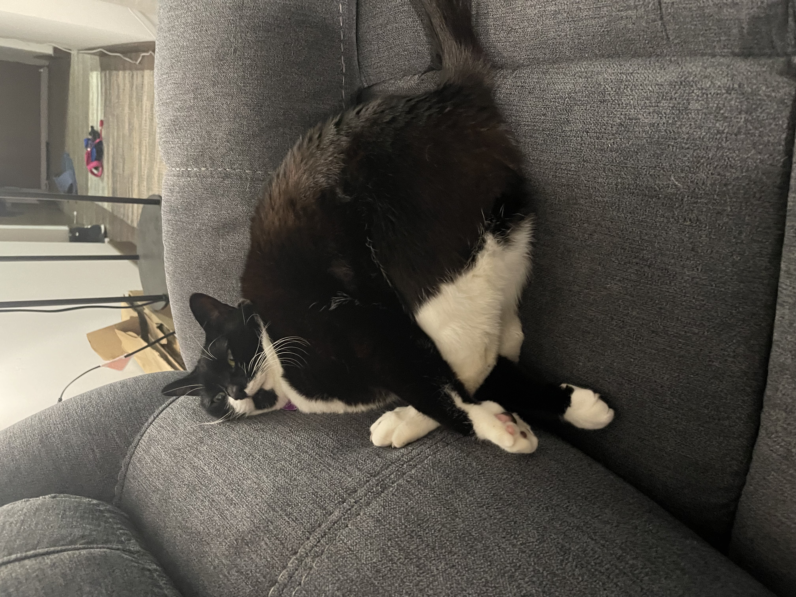
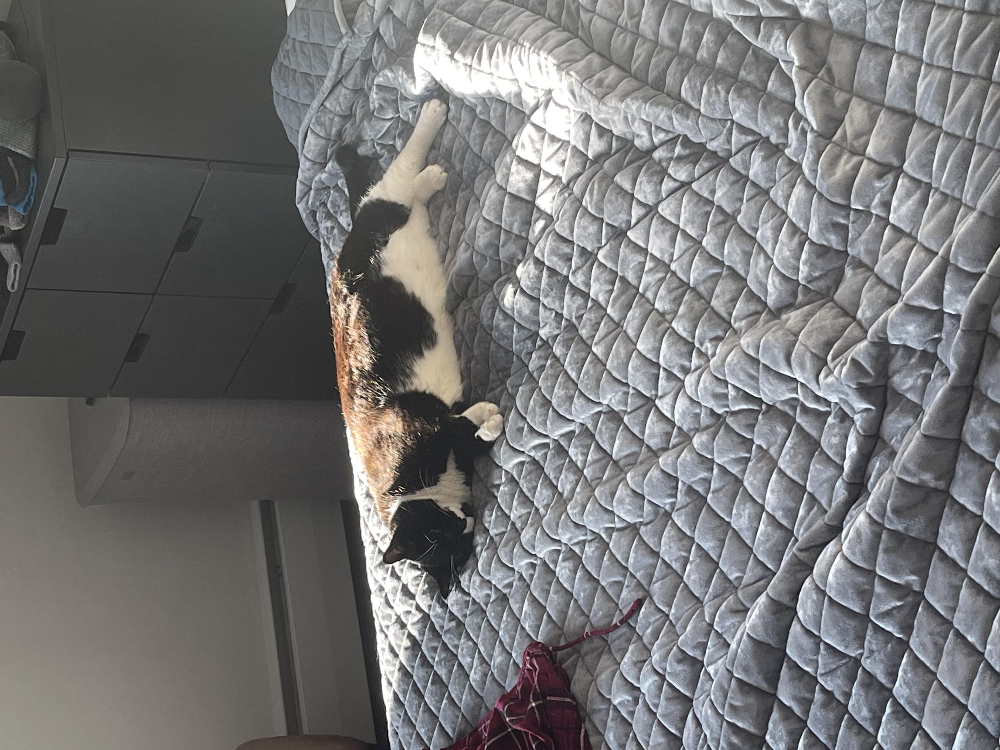
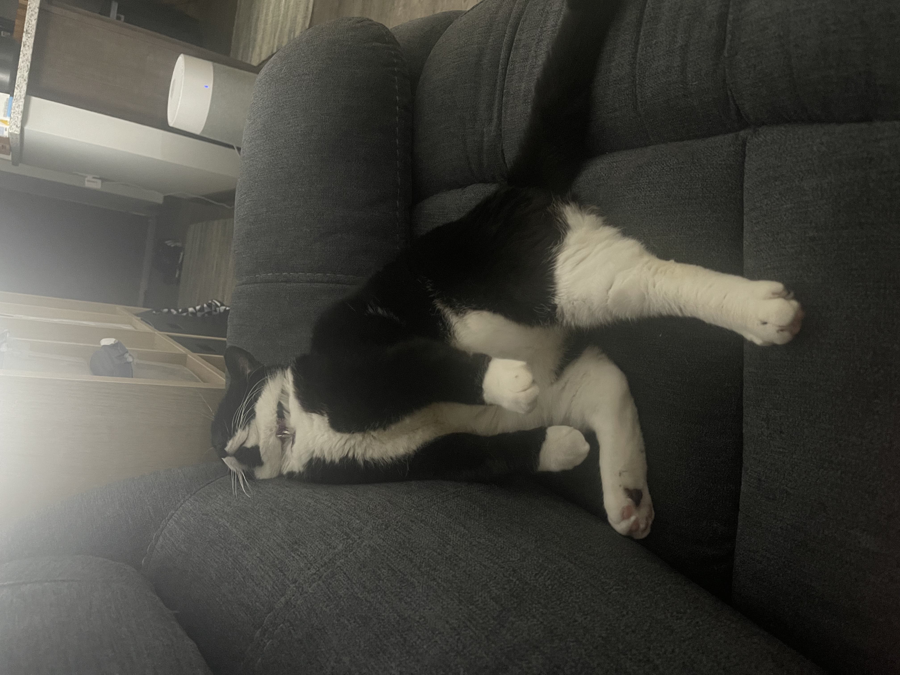
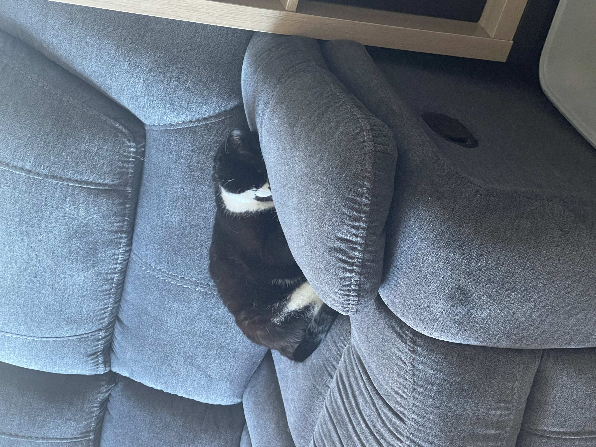
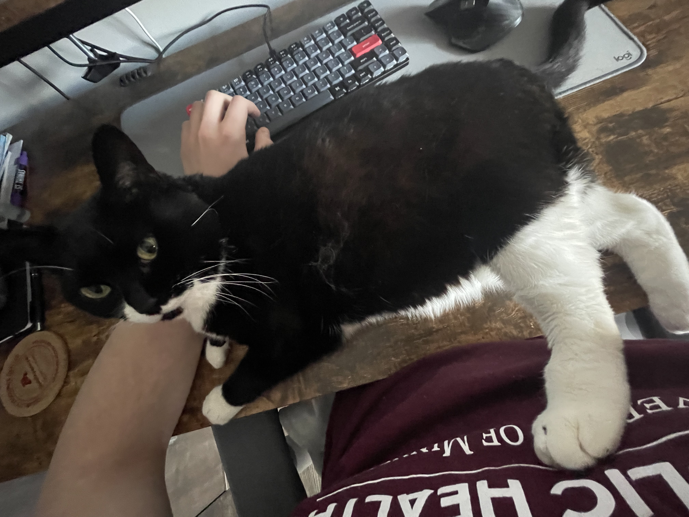

---
format:
  revealjs:
    smaller: true
    scrollable: true

---

```{r, eval=FALSE, echo=FALSE,message=FALSE}
all_files <- list.files(".")[-1]

for (file in all_files) {
  cat(paste0(", ")\n"))
}

```

## 

## 

## 

## 

## 

## 

## 

## 

## 

## 

## 

##  

## 

## 

## 
